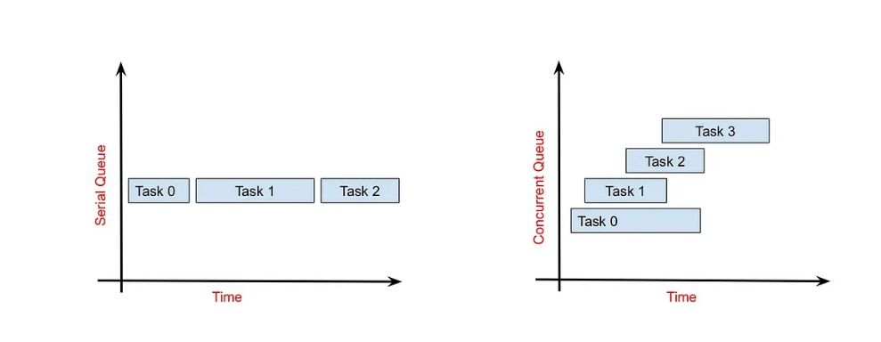
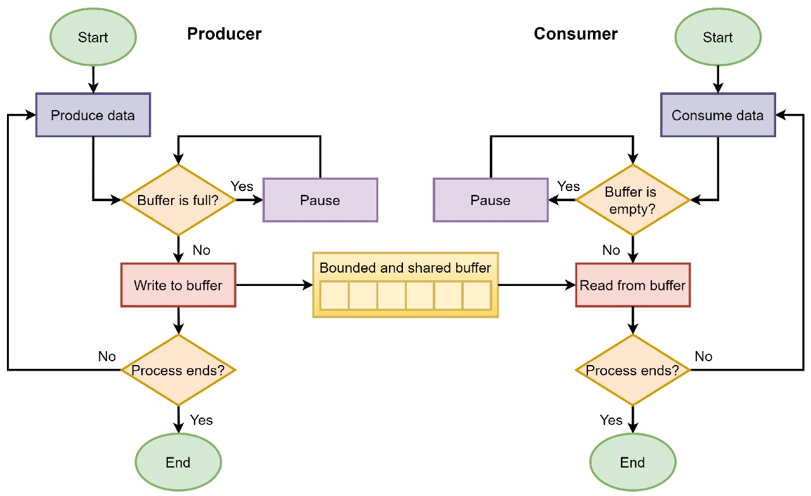

# Tugas 11
## Perbedaan Concurrent Parallel, dan Concurrent Parallel
Secara sederhana:
- Concurrent: Beberapa tugas berjalan pada waktu yang bersamaan, tetapi mungkin tidak secara benar-benar serentak. Mereka bisa bergantian dijalankan, dan sistem mengalihkan perhatian dari satu tugas ke yang lain.
  - Contoh: Mengerjakan beberapa tugas dalam satu waktu, seperti menulis email sambil mendengarkan musik. Anda tidak melakukan keduanya secara persis pada saat yang sama, tetapi bergantian di antara mereka.

- Parallel: Beberapa tugas benar-benar berjalan secara serentak, pada waktu yang bersamaan, mungkin di prosesor yang berbeda.
  - Contoh: Mengerjakan proyek bersama dengan rekan tim, di mana masing-masing dari Anda bekerja pada bagian yang berbeda secara bersamaan. Setiap orang mengambil bagian tertentu dan bekerja pada bagian tersebut pada saat yang bersamaan.
 
- Concurrent Parallel: Menggabungkan konsep konkuren dan paralel. Dalam sistem ini, beberapa tugas berjalan secara konkuren (bergantian menggunakan waktu CPU), dan beberapa di antaranya juga berjalan secara paralel (benar-benar berjalan bersamaan pada prosesor atau core yang berbeda).
  - Contoh: Bayangkan sebuah restoran besar. Ada beberapa pelayan yang melayani beberapa meja secara konkuren (bergantian di antara meja-meja), dan ada beberapa koki yang memasak hidangan secara paralel (masing-masing koki memasak hidangan berbeda pada saat yang sama).
- Gambar Ilustrasi:
- 
- Sumber: https://devopedia.org/concurrency-vs-parallelism

## Perbedaan Concurrent dan Serial
Secara sederhana:
- Concurrent: Beberapa tugas berjalan pada waktu yang bersamaan, tetapi mungkin tidak benar-benar serentak. Mereka bisa bergantian dijalankan, dan sistem mengalihkan perhatian dari satu tugas ke yang lain.
  - Contoh: Melakukan beberapa tugas dalam satu waktu, tetapi mungkin secara bergantian. Misalnya, membaca email sambil mendengarkan musik. Anda mungkin beralih di antara membaca email dan mendengarkan musik, tetapi keduanya berjalan pada saat yang bersamaan.

- Serial: Tugas-tugas dieksekusi satu per satu, berurutan, tanpa adanya tumpang tindih. Satu tugas harus menunggu penyelesaian tugas sebelumnya sebelum dapat dijalankan.
  - Contoh: Mengerjakan satu tugas pada satu waktu. Misalnya, mencuci piring, kemudian membersihkan meja, dan seterusnya.
- Gambar Ilustrasi:
- 
- Sumber: Internet

## Dining Philosophers Problem dan Reader Writer Problem
- Dining Philosophers Problem:
  - Ada beberapa filsuf yang duduk di sekitar meja bundar.
  - Di antara setiap dua filsuf ada satu sumpit.
  - Filsuf bisa 'berpikir' atau 'makan'.
  - Untuk makan, seorang filsuf harus memiliki dua sumpit.
  - Tantangannya adalah mencegah semua filsuf kelaparan (tidak bisa makan) atau terjebak dalam situasi di mana mereka saling menunggu satu sama lain.
  - Solusinya adalah mengatur aturan yang memungkinkan beberapa filsuf untuk makan secara bersamaan tanpa mengunci sumber daya yang dibutuhkan oleh filsuf lain.

- Reader Writer Problem:
  - Ada beberapa proses: pembaca dan penulis.
  - Sumber daya bersama dibagi antara mereka.
  - Pembaca hanya membaca, sementara penulis dapat menulis ke sumber daya.
  - Tantangannya adalah memastikan pembaca dapat membaca bersamaan tanpa menghalangi penulis, dan sebaliknya, hanya satu penulis yang dapat menulis pada satu waktu tanpa menghalangi pembaca.
  - Solusinya adalah menggunakan semacam mekanisme (misalnya, semafor atau mutex) untuk memastikan bahwa akses ke sumber daya dikontrol dengan benar: hanya satu penulis yang dapat menulis pada satu waktu, dan pembaca dapat membaca bersamaan selama tidak ada penulis yang menulis.

## Producer-Consumer Problem
Ilustrasi producer-consumer problem dengan solusi bounded buffer:

