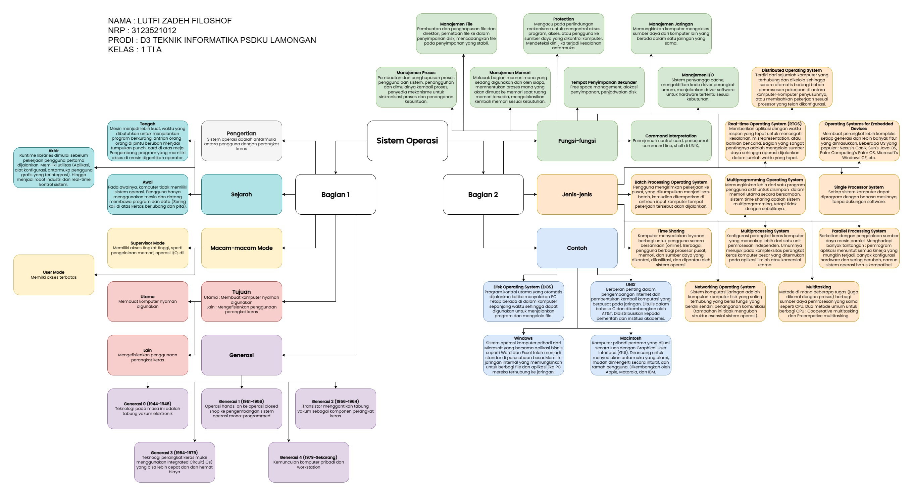

# Tugas 3
## Mindmap Sejarah, Cara Kerja, dan Fungsi-fungsi Sistem Operasi

## Perbedaan BIOS dan UEFI
1. Arsitektur dan Desain:
- BIOS: Tradisionalnya, BIOS menggunakan model arsitektur firmware yang berbeda dan sering kali terbatas dalam kemampuan dan fleksibilitasnya. BIOS menggunakan MBR (Master Boot Record) untuk menyimpan informasi partisi dan kode bootloader.
- UEFI: UEFI dirancang dengan arsitektur yang lebih modern dan modular. EFI menggunakan GPT (GUID Partition Table) sebagai pengganti MBR, dan ini memungkinkan dukungan untuk partisi yang lebih besar dan lebih banyak partisi.

2. Bootloader:
- BIOS: Menggunakan bootloader yang terintegrasi dengan firmware dan biasanya terbatas pada bootloaders seperti GRUB atau LILO.
- UEFI: Dapat menggunakan bootloader yang terpisah dari firmware. UEFI mendukung bootloader seperti GRUB, rEFInd, atau Microsoft Boot Manager.

3. Antarmuka Pengguna:
- BIOS: Umumnya menggunakan antarmuka pengguna yang sederhana dan terbatas, sering kali hanya dapat diakses melalui tombol khusus saat boot.
- UEFI: Menyediakan antarmuka pengguna yang lebih canggih, sering kali dengan dukungan untuk mouse dan grafis. UEFI Shell memungkinkan pengguna untuk berinteraksi dengan firmware secara lebih kompleks.

4. Dukungan Perangkat Keras:
- BIOS: Terbatas dalam mendukung perangkat keras modern dan fitur canggih seperti booting dari disk berkapasitas besar atau keamanan boot yang tinggi.
- UEFI: Lebih fleksibel dan mendukung perangkat keras modern dengan lebih baik, seperti boot dari disk berkapasitas besar (lebih dari 2 TB) dan keamanan boot berbasis UEFI Secure Boot.

5. Kompatibilitas Sistem Operasi:
- BIOS: Umumnya lebih terbatas dalam mendukung sistem operasi modern, terutama sistem operasi 64-bit.
- UEFI: Lebih mendukung sistem operasi modern dan dapat bekerja dengan baik dengan sistem operasi 32-bit dan 64-bit.
Pada umumnya, UEFI dianggap lebih canggih dan fleksibel daripada BIOS, dan banyak sistem modern mengadopsi UEFI sebagai pengganti BIOS.
