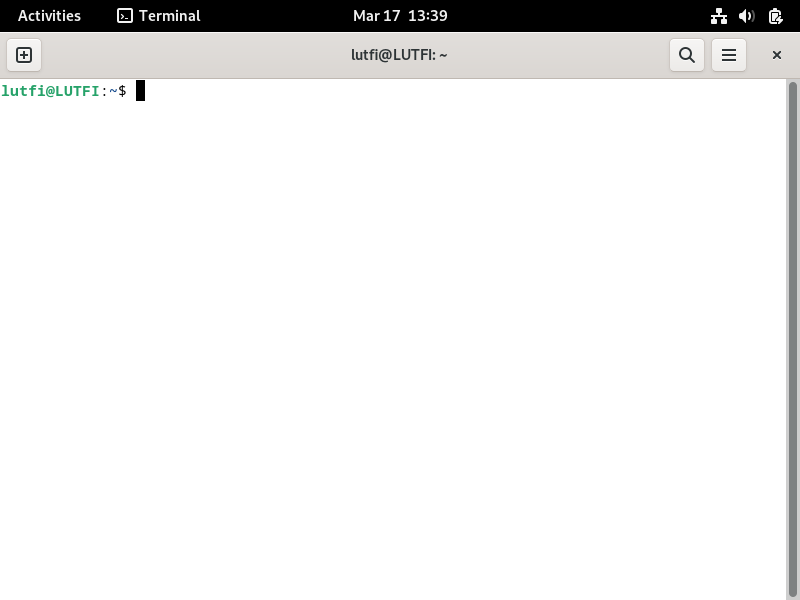

# Tugas 4
## Presentasi Langkah Demi Langkah Tentang Siklus CPU (Fetch, Decode, Execute)

- Inisialisasi awal

1. Proses 1
   - 
   - 
     - Fetch
       - Programme Counter mulai dari 0 (alamat instruksi di memori)
       - CPU mengambil instruksi (LOAD 6) dari memori, kemudian valuenya diletakkan di Instruction Register

     - 
       - Decode
         - CPU menerjemahkan instruksi menjadi operasi yang dapat dipahami

      
      - Execute
        - LOAD 6 yang berarti CPU menampilkan value dari memori yang beralamat 6 ke accumulator

2. Proses 2
   - 
   - 
     - Fetch
       - Programme Counter increment (bertambah 1) menjadi 1
       - CPU mengambil instruksi (ADD 7) dari memori, kemudian valuenya diletakkan di Instruction Register

   - 
     - Decode
       - CPU menerjemahkan instruksi menjadi operasi yang dapat dipahami

   - 
     - Execute
       - CPU menambah value dari RAM address 7 ke accumulator

3. Proses 3
   - 
   - 
     - Fetch
       - Programme Counter increment (bertambah 1) menjadi 2
       - CPU mengambil instruksi (STORE 6) dari memori, kemudian valuenya diletakkan di Instruction Register

   - 
     - Decode
       - CPU menerjemahkan instruksi menjadi operasi yang dapat dipahami

   - 
     - Execute
       - CPU memasukkan value dari accumulator ke RAM address 6

4. Proses 4
   - 
   - 
     - Fetch
       - Programme Counter increment (bertambah 1) menjadi 3
       - CPU mengambil instruksi (JUMP 1) dari memori, kemudian valuenya diletakkan di Instruction Register

   - 
     - Decode
       - CPU menerjemahkan instruksi menjadi operasi yang dapat dipahami

   - 
     - Execute
       - CPU kembali mengakses ke RAM address 1

- Proses fetch->decode->execute terjadi berulang-ulang (looping) sampai perintah selesai dieksekusi semuanya.
- Setiap proses terjadi dalam satu kali jentikan jari.

# Tugas 5
## Peran Bahasa Pemrograman, Compiler, dan Sistem Operasi
1. Peran bahasa pemrograman
   - Sebagai alat untuk menulis instruksi yang dimengerti oleh manusia
2. Peran compiler
   - Sebagai alat untuk menerjemahkan source code dalam bahasa pemrograman tingkat tinggi menjadi kode mesin yang dapat dipahami oleh CPU
3. Peran sistem operasi
   - Sebagai perantara antara program aplikasi dan perangkat keras komputer dan menyediakan lingkungan eksekusi yang diperlukan

# Tugas 6
## Instalasi Debian dan Melakukan FLOPS IOPS
### Install Debian
1. Download installer Debian [di sini](https://cdimage.debian.org/debian-cd/current/amd64/iso-dvd/debian-12.5.0-amd64-DVD-1.iso)
2. Buka Virtual Machine (VM)
3. Klik *New* di bagian atas
4. Beri nama (Misal: *Debian12 Desktop Lutfi*, maka type akan menyesuaikan)
5. Klik *Next* -> *Next* -> *Next* -> *Finish*
6. Klik *Start* di bagian atas
7. Tunggu hingga muncul pop up
8. Jika sudah muncul, klik tanda panah ke bawah -> *Other*
9. Cari dan pilih installer Debian yan sudah didownload
10. Klik *Mount and Retry Boot*
11. Klik *Install*
12. Pilih bahasa (Contoh: English)
13. Pilih lokasi (Jika Indonesia, maka klik *other* -> *Asia* -> *Indonesia*)
14. Pilih konfigurasi lokal (Direkomendasikan United States)
15. Pilih konfigurasi keyboard (Biasanya American English)
16. Masukkan hostname (Contoh: LUTFI)
17. Masukkan domain name (Contoh: lutfi.pens.ac.id)
18. Masukkan password root (Default: 1) dan masukkan verifikasi password root yang sudah dimasukkan tadi
19. Masukkan fullname untuk user baru (Contoh: lutfi)
20. Masukkan username untuk akun (Contoh: lutfi)
21. Masukkan password untuk user tadi (Contoh: 123lutfi-) dan masukkan verifikasi password untuk user yang sudah dimasukkan tadi
22. Pilih konfigurasi waktu (WIB: *Western*, WITA: *Central*, WIT: *Eastern*)
23. Pilih partition disks (Contoh: *Guide - use entire disks*)
24. Pilih *SCS13~~~*
25. Pilih *All files in one partition (Recommended for new users)*
26. Pilih *Finish partitioning and write changes to disks*
27. Pilih *Yes*
28. Jika muncul pop up konfigurasi package manager, pilih *No*
29. Jika muncul pop up konfigurasi package manager kedua (use a network mirror), pilih *Yes*
30. Jika muncul pilih Debian archive mirror country, pilih *Go Back*, lalu pilih *Yes*
31. Jika muncul pop up konfigurasi popularity-contest, pilih *Yes*
32. Pilih software, pastikan *Debian desktop environment* dan *...GNOME* terbintang (Cara memberi bintang: klik spasi)
33. Tunggu (Memerlukan waktu lebih lama)
34. Instal GRUB boot loader (Pilih *Yes*)
35. Pilih */dev/sda~~~*
36. Finish the installation (Pilih *Continue* untuk mereboot sistem)
37. Pilih *Debian GNU/Linux* (Opsional, jika tidak dienter akan otomatis memilih ini)
38. Selamat! Debian sudah terinstall hehe...
39. Klik user lalu masukkan password user, bukan root (Langkah 21)
40. Selamat!!! Anda sudah masuk ke desktop Debian eak
- NB: ~~~ = Keterangan pengganti kalimat lanjutan

### FLOPS IOPS
1. Instalasi gcc, make, dan git


- Masuk ke terminal Debian


- Login sebagai super user


- Install gcc


- Install make


- Install git

2. Melakukan clone dan flops iops

- Melakukan clone ke https://github.com/ferryastika/flops-iops


- Cek file/direktori yang tersedia


- Masuk ke direktori flops-iops


```fish
$ make
```


```fish
$ make clean
```


```fish
$ sudo make install
```


```fish
$ sudo make uninstall
```


- Percobaan 1


- Percobaan 2


- Percobaan 3


- Percobaan 4


- Percobaan 5
```sh
$ iops64 1
$ flops64 1
```
Keterangan : 1 = Jumlah CPU VM Debian

- Hasil perbandingan IOPS dan FLOPS dengan teman


- Analisa hasil percobaan dan kesimpulan IOPS dan FLOPS
   - Iops mengukur jumlah integer yang dapat dilakukan oleh sistem dalam satu detik
   - Flops mengukur jumlah floating-point yang dapat dilakukan oleh sistem dalam satu detik
   - 64 menunjukkan bahwa pengukuran ini berlaku untuk sistem 64 bit
