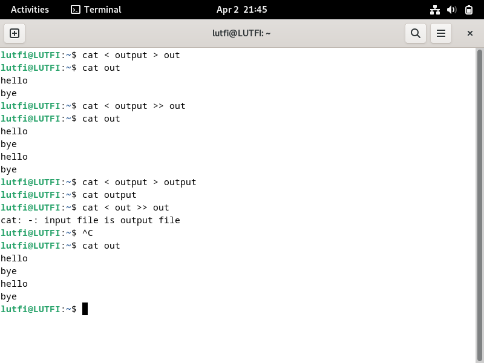

# Tugas 7
## Tugas Pendahuluan
1.	Apa yang dimaksud redirection?
- Redirection adalah pembelokan, yaitu untuk mengalihkan file descriptor dari 0, 1, dan 2
2.	Apa yang dimaksud pipeline?
- Pipeline adalah alat komunikasi antar proses, yang menghubungkan proses 1 dengan proses 2
3.	Apa yang dimaksud perintah di bawah ini:
- echo, cat, more, sort, grep, wc, cut, uniq
- echo untuk mengisi file
- cat untuk mengisi kemudian menampilkan isi file
- more untuk menampilkan isi lebih detail dari suatu folder
- sort untuk mengurutkan masukannya berdasarkan urutan ASCII
- grep untuk menyaring dan menampilkan baris-baris yang mengandung pola tertentu
- wc untuk menghitung jumlah baris, kata, dan karakter dari baris-baris yang masukan
- cut untuk mengambil kolom tertentu dari baris-baris masukannya
- uniq untuk menghilangkan baris-baris berurutan yang mengalami duplikasi

## Percobaan
1.	Percobaan 1 : File descriptor
      1)	Output ke layar (standar output), input dari system (kernel)
      
      ```
      $ ps untuk mendeskripsikan file
      ```
      2)	Output ke layar (standar output), input dari keyboard (standard input)
      
      ```
      $ cat untuk menulis pesan
      ```
      3)	Input nama direktori, output tidak ada (membuat direktori baru), bila terjadi error maka tampilan error pada layar (standard error)
      

      ```
      $ mkdir untuk membuat direktori/folder baru
      ```

2.	Percobaan 2 : Pembelokan (redirection)
      1)	Pembelokan standar output
      
      ```
      $ cat 1> (nama file) untuk mengisi file
      ```
      2)	Pembelokan standar input, yaitu input dibelokkan dari keyboard menjadi dari file
      
      ```
      $ cat 0< (nama file) atau cat (nama file) untuk melihat isi file
      ```
      3)	Pembelokkan standar error untuk disimpan di file
      
      ```
      $ mkdir (nama direktori yang sudah ada) 2> (nama file) untuk menampilkan error
      ```
      4)	Notasi 2>&1 : pembelokan standar error (2>) adalah identik dengan file descriptor 1
      
      ```
      Notasi 2>&1 = 2> untuk pembelokan standar error
      ```
      5)	Notasi 1>&2 (atau >&2) : pembelokan standar output adalah sama dengan file descriptor 2 yaitu standar error
      
      ```
      Notasi 1>&2 = &2 untuk pembelokan standar error
      ```
      6)	Notasi >> (append)
      
      ```
      Notasi > untuk mengisi file, notasi >> untuk menambahkan isi file
      ```
      7)	Notasi here document (<<++ .... ++) digunakan sebagai pembatas input dari keyboard. Perhatikan bahwa tanda pembatas dapat digantikan dengan tanda apa saja, namun harus sama dan tanda penutup            harus diberikan pada awal baris
      
      ```
      $ cat <<++ diakhiri ++ = $ cat <<%%% diakhiri %%% untuk menulis beberapa baris tulisan
      ```
      8)	Notasi – (input keyboard) adalah representan input dari keyboard. Artinya menampilkan file 1, kemudian menampilkan input dari keyboard dan menampilkan file 2. Perhatikan bahwa notasi “-“ berarti        menyelipkan input dari keyboard
      
      ```
      Notasi – untuk menampilkan file
      ```

3.	Percobaan 3 : Pipa (pipeline)
      1)	Operator pipa (|) digunakan untuk membuat eksekusi proses dengan melewati data langsung ke data lainnya.
      
      
      ```
      Operator | untuk mengeksekusi proses dengan melewati data langsung ke data lainnya (Tidak semua hasil dicapture)
      ```
      2) Untuk membelokkan standart output ke file, digunakan operator ">"
      
      3) Untuk menambahkan output ke file digunakan operator ">>"
      
      4) Untuk membelokkan standart input digunakan operator "<"
      
      5) Pembelokan standart input dan standart output dapat dikombinasikan tetapi tidak boleh menggunakan nama file yang sama sebagai standart input dan output.
      

4.	Percobaan 4 : Filter
      1)	Pipa juga digunakan untuk mengkombinasikan utilitas sistem untuk membentuk fungsi yang lebih kompleks
      
      
      ```
      Operator | bisa dikombinsikan untuk membuat fungsi lebih kompleks (Ini adalah percobaan kedua, karena yang pertama ada kesalahan penulisan  data)
      ```

## Latihan
1.	Lihat daftar secara lengkap pada direktori aktif, belokkan tampilan standar output ke file baru.


2.	Lihat daftar secara lengkap pada direktori /etc/passwd, belokkan tampilan standar output ke file baru tanpa menghapus file baru sebelumnya.


3.	Urutkan file baru dengan cara membelokkan standar input.


4.	Urutkan file baru dengan cara membelokkan standar input dan standar output ke file baru.urut.


5.	Buatlah direktori latihan 2 sebanyak 2 kali dan belokkan standar error ke file rmdirerror.txt.

Notasi 2> untuk pembelokan standar error

7.	Urutkan kalimat berikut:
```
Jakarta
Bandung
Surabaya
Padang
Palembang
Lampung
```
Dengan menggunakan notasi here document (<@@@ ...@@@)

Kombinasi here document **<<@@@ ...@@@** dan **| sort** menghasilkan output dengan abjad yang urut

7.	Hitung jumlah baris, kata, dan karakter dari file baru.urut dengan menggunakan filter dan tambahkan data tersebut ke file baru.

Kombinasi antara | wc dan notasi > untuk memasukkan data jumlah baris, kata, dan karakter ke file lain
8.	Gunakan perintah di bawah ini dan perhatikan hasilnya.
```
$ cat > hello.txt
dog cat
$ cat duck
dog chicken
chicken duck
chicken cat
dog duck
[Ctrl-d]
$ cat hello.txt | sort | uniq
$ cat hello.txt | grep “dog” | grep -v “cat”
```

Command ini berisi pemasukan data ke file hello.txt yang kemudian diurutkan dan menampilkan data, yang mengandung kata “dog”, tetapi tidak mengandung kata “cat”
