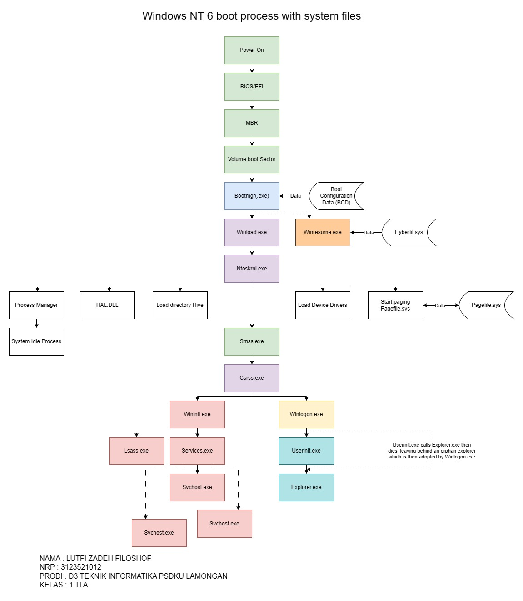

# Tugas 2
## Boot Process

1. Setelah menyalakan mesin, BIOS (atau EFI) mendapatkan kendali prosesor. BIOS membaca Master Boot Record dari Hard disk ke memori fisik dan mengatur register mikroprosesor untuk melompat ke Kode Master Boot Record.
2. Master Boot Record (MBR) adalah area khusus yang berisi informasi tentang hard disk, tabel partisi dan partisi mana adalah partisi bootable aktif pada hard disk. Kontrol kemudian diteruskan ke loader sistem operasi yaitu MBR memuat Volume Boot Record (VBR) ke dalam memori.
3. Poin 2 adalah kasus ketika hanya ada satu sistem operasi diinstal pada mesin. Jika ada beberapa operasi sistem (seperti kasus dual boot) maka MBR perlu melakukan operasi yang lebih kompleks. Karena terbatas ukuran Master Boot Record tidak dapat berisi kumpulan yang sangat besar atau kompleks peraturan. Oleh karena itu dapat memuat boot loader pada titik ini, bukan sistem operasi. Misalnya dalam kasus dari sistem dual boot boot loader seperti GRUB dimuat yang dapat memberi Anda Beberapa opsi untuk dipilih untuk mem-boot sistem operasi.
4. Melanjutkan dengan contoh GRUB, itu berisi pengidentifikasi partisi tempat OS diinstal. Jika pengguna memilih untuk boot di Windows GRUB akan meneruskan kontrol ke Volume Boot Sector dari partisi yang diharapkan Windows ada. Proses memuat OS melalui Boot loader (seperti grub) disebut chain Loading.
5. NT Boot Sector melayani tujuannya membaca dari sistem file NTFS, Kami sekarang berada di dalam sistem file NTFS dan dari sini Seterusnya file dengan ekstensi .exe akan mulai muncul.
Tujuan utama dari sektor NT Boot adalah untuk membaca dan memuat file BOOTMGR yang merupakan sistem tersembunyi file yang terletak di partisi %SYSTEMROOT% atau di partisi EFI, oleh karena itu tidak akan ditampilkan jika dicari di hard disk menggunakan Windows Penjelajah. File tidak dapat dieksekusi karena memiliki header 16 bit, itu dimulai mengeksekusi dalam 32 bit kemudian, secara otomatis.
6. File BOOTMGR terletak di 'c: \ folder'. Dalam banyak teks, bootmgr disebut bootmgr.exe
7. BOOTMGR, pada dasarnya, menggantikan file NTLDR dari era pra-Vista. BOOTMGR memeriksa status sistem jika Sistem sedang hibernasi. Pada titik ini proses boot dapat bercabang menjadi dua Cara.
8. BOOTMGR memeriksa Konfigurasi Boot File data (BCD) yang terletak di Partisi Sistem EFI, oleh karena itu BCD tidak akan ditampilkan jika dicari menggunakan Windows Explorer seperti pada Partisi Sistem yang berbeda. File BCD berisi informasi mengenai proses boot. Tujuan BCD dapat dengan mudah dipahami Mengetahui bahwa itu menggantikan file boot.ini dari era pra-Vista.
Format isi BCD sama seperti Windows Registry, dan itu sangat cocok untuk BCD untuk memiliki Binary Windows Registry seperti format sebagai konten berkas BCD dimuat di registri Windows di bawah kunci: HKEY_LOCAL_MACHINE\BCD0000.
BCD disimpan dalam format registri windows dan dapat diedit menggunakan bcedit.exe, juga dapat diedit menggunakan Editor registri karena dimuat ke registri, dan bisa juga diedit menggunakan Windows Management Instrumentation atau alat pihak ketiga lainnya.
9. Jika sistem dalam hibernasi atau tidur maka Bootmgr melewati kontrol ke WINRESUME.EXE.
10. WINRESUME.EXE, seperti namanya, resume Windows ke keadaan itu sebelum masuk ke Hibernasi.
11. Kalau mesin tidak dalam hibernasi, kontrol dari BOOTMGR akan diteruskan ke WINLOAD.exe
12. Penting untuk dicatat di sini bahwa dengan Winresume.exe dan Winload.exe kita telah memasuki ranah file exe windows. Ini juga merupakan bagian di mana proses boot bercabang berdasarkan keputusan pada apakah proses boot setelah shutdown atau hibernasi.
Memuat salah satu winload.exe atau winresume.exe adalah tujuan utama dari Windows Boot Manager alias bootmgr(.exe).
13. Pertama-tama kita akan menyusuri jalan WINLOAD.EXE. WINLOAD.EXE mengimplementasikan apa yang sebelumnya merupakan fungsi NTLDR. WINLOAD.EXE melakukan hal berikut:
a. Memuat driver kelas boot, ini adalah driver dibutuhkan pada saat startup. Jika driver ini tidak dimuat saat ini kesalahan seperti: "Perangkat boot tidak dapat diakses", "Pengaturan tidak dapat menentukan mesin Anda jenis" atau "Pengaturan tidak dapat menemukan hard drive apa pun di komputer Anda" dapat berupa Dihadapi.
b. Memuat dependensi untuk kernel.
c. Banyak HAL.DLL (dibahas di bawah)
d. Kernel dari Microsoft Windows yaitu, NTOSKERNEL.EXE
e. Memuat kumpulan registri SISTEM.
f. Memuat driver perangkat kelas 'boot' dan kernel-mode dll diimpor oleh hal.dll

## Identifikasi Laptop
ASUS TUF GAMING F15

1. CPU :

- 
- Menggunakan processor : Intel Core I5 10300H dengan cores : 4

2. Mainboard :

- 
- Menggunakan motherboard : ASUSTeK COMPUTER INC. dengan model : FX506LHB dan brand BIOS : American Megatrends Inc.

3. Memory :

- 
- Dual DDR4 dengan ukuran 16GBytes

4. SPD :

- 
- 
- Slot 1 menggunakan DDR4 8GB dengan module manuf Micron Technology dan slot 3 menggunakan DDR4 8GB dengan module manuf Lexar

5. Graphics  :

- 
- 
- Menggunakan Intel(R) UHD Graphics dan NVIDIA GeForce GTX 1650

6. Bench :

- 
- Menggunakan benchmark versi 17.01.64

## Mindmap Sejarah, Cara Kerja, dan Fungsi-fungsi Sistem Operasi

## Perbedaan BIOS dan EFI
1. Arsitektur dan Desain:
- BIOS: Tradisionalnya, BIOS menggunakan model arsitektur firmware yang berbeda dan sering kali terbatas dalam kemampuan dan fleksibilitasnya. BIOS menggunakan MBR (Master Boot Record) untuk menyimpan informasi partisi dan kode bootloader.
- EFI: EFI dirancang dengan arsitektur yang lebih modern dan modular. EFI menggunakan GPT (GUID Partition Table) sebagai pengganti MBR, dan ini memungkinkan dukungan untuk partisi yang lebih besar dan lebih banyak partisi.

2. Bootloader:
- BIOS: Menggunakan bootloader yang terintegrasi dengan firmware dan biasanya terbatas pada bootloaders seperti GRUB atau LILO.
- EFI: Dapat menggunakan bootloader yang terpisah dari firmware. EFI mendukung bootloader seperti GRUB, rEFInd, atau Microsoft Boot Manager.

3. Antarmuka Pengguna:
- BIOS: Umumnya menggunakan antarmuka pengguna yang sederhana dan terbatas, sering kali hanya dapat diakses melalui tombol khusus saat boot.
- EFI: Menyediakan antarmuka pengguna yang lebih canggih, sering kali dengan dukungan untuk mouse dan grafis. EFI Shell memungkinkan pengguna untuk berinteraksi dengan firmware secara lebih kompleks.

4. Dukungan Perangkat Keras:
- BIOS: Terbatas dalam mendukung perangkat keras modern dan fitur canggih seperti booting dari disk berkapasitas besar atau keamanan boot yang tinggi.
- EFI: Lebih fleksibel dan mendukung perangkat keras modern dengan lebih baik, seperti boot dari disk berkapasitas besar (lebih dari 2 TB) dan keamanan boot berbasis UEFI Secure Boot.

5. Kompatibilitas Sistem Operasi:
- BIOS: Umumnya lebih terbatas dalam mendukung sistem operasi modern, terutama sistem operasi 64-bit.
- EFI: Lebih mendukung sistem operasi modern dan dapat bekerja dengan baik dengan sistem operasi 32-bit dan 64-bit.
Pada umumnya, EFI dianggap lebih canggih dan fleksibel daripada BIOS, dan banyak sistem modern mengadopsi EFI sebagai pengganti BIOS.
